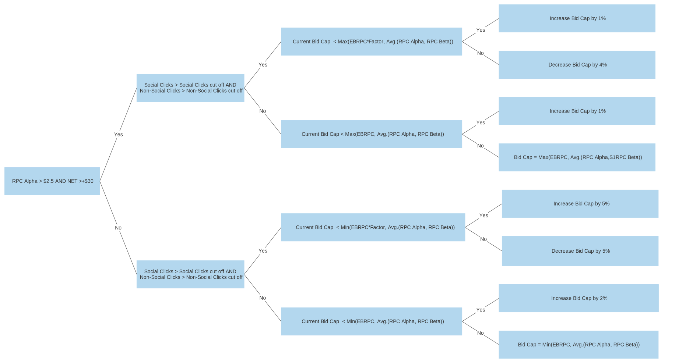

# AdNet Engineering Node.js API Challenge

There are a lot of factors that go into deciding what price we want to bid when
buying ads. We need an API that implements the [bid cap](https://www.facebook.com/business/help/272503946776144?id=2196356200683573) strategy generated by our data
scientists to help us determine what the best the bid cap will be.

## The Challenge

Implement a bid cap strategy in a REST api that can be `POST`ed to.

A number of different factors go into determining whether or not we want to
increase or decrease our current bid cap. Following the instructions
laid out below, build an API that can take the following parameters and return an updated bid cap:

```
rpcAlpha: 3.0, // currency
rpcBeta: 3.2, // currency
ebRpc: 25 // currency
net: 29 // currency
nonSocialClicks: 0.30 // percentage
nonSocialClicksCutOff: 0.26 // percentage
socialClicks: 0.69 // percentage
socialClicksCutOff: 0.68 // percentage
currentBidCap: 5 // currency
factor: 1.45
```

### Bid Cap Strategy



[Link to image](https://raw.githubusercontent.com/Interlincx/challenge-decision-tree/master/adnet-code-challenge-decision-tree.svg)

A successful post should return the following format:
```
data: {
  bidCap: 5.05 // currency
}
```

## Requirements

1. New endpoint that needs to be built:
   - POST `/bid-cap`
      - Return a bid cap percentage based on the decision tree.
      - Validate that all necessary inputs are there and of the correct type of value.
      - Return a 400 if the inputs are invalid.
2. Tests
   - There are a total of 8 outcomes on the decision tree. Write a test for each outcome.
      1. Increase Bid Cap by 1%
      2. Decrease Bid Cap by 4%
      3. Increase Bid Cap by 1%
      4. Bid Cap = Max(EBRPC, Avg.(RPC Alpha, RPC Beta))
      5. Increase Bid Cap by 5%
      6. Increase Bid Cap by 5%
      7. Increase Bid Cap by 2%
      8. Bid Cap = Min(EBRPC, Avg.(RPC Alpha, RPC Beta))

   - Write a test for when the validation fails

## Instructions

How to attempt this challenge:

1. Create a new repo in your account and note the git url
2. Clone this repo
3. Solve the challenge
4. Set your new repo as the origin: `git remote set-url origin ${your repo url}`
5. Push your solution to your repo

You must follow these steps for your solution to be accepted -- forks or other methods will not be considered.
